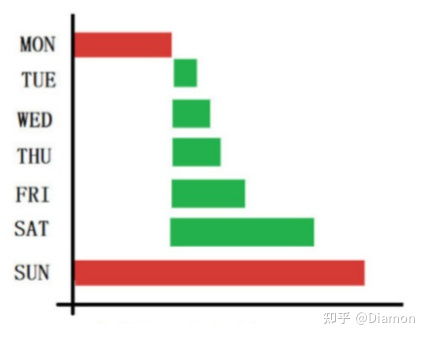

# MySQL高级

## 一、初始环境和数据准备

### 1.搭建初始环境

安装*MySQL8*或者*MySQL_5.5.5*及以上（MySQL从5.5.5开始将*InnoDB*作为默认的存储引擎）

> 安装教程参考： [CentOS 安装 MySQL8](https://juejin.cn/post/7056265988673568781)
>
> centos7也可使用，如果没有 wget 可以使用 **yum -y install wget** 安装 wget

### 2.导入初始数据

将本项目的SQL脚本导入到数据库即可

## 二、MySQL架构篇

### 1.MySQL架构体系

MySQL 由连接池、SQL 接口、解析器、优化器、缓存、存储引擎等组成，可以分为四层，即连接层、 服务层、引擎层和文件系统层。


- **连接层**——上面是一些客户端和连接服务, 不是MySQL特有的，所有基于网络的C/S的网络应用程序都应该包括 连接处理、认证、安全管理等。
- **服务层**——中间层是MySQL的核心，包括查询解析、分析、优化和缓存等。同时它还提供跨存储引擎的功能，包括 存储过程、触发器和视图等。
- **引擎层**——存储引擎层，它负责存取数据。服务器通过API可以和各种存储引擎进行交互。不同的存储引擎具有不同 的功能,我们可以根据实际需求选择使用对应的存储引擎（**InnoDB是适合事务比较多的查询引擎**）
- **存储层**——数据存储层,主要是将数据存储在运行于裸设备的文件系统之上,并完成与存储引擎的交互

### 2.SQL查询流程

> [图解MySQL架构设计](https://z.itpub.net/article/detail/986CF0DCB22B2175F762871114701F29) 此篇文章详细的描述了MySQL中一条SQL语句的执行过程


### 3.MySQL物理文件

物理文件包括：日志文件，数据文件，配置文件

> **日志文件包括**

- **error log** 错误日志 排错 /var/log/mysqld.log【默认开启】
- **bin log** 二进制日志 备份 增量备份 DDL DML DCL
- **Relay log** 中继日志 复制 接收 replication master
- **slow log** 慢查询日志 调优 查询时间超过指定值

```sql
-- 查看错误日志文件路径 
show variables like 'log_error';

-- 慢查询日志文件路径 
show variables like 'slow_query_log_file';

-- bin log 日志文件 需要在 my.cnf 中配置 
log-bin=/var/log/mysql-bin/bin.log 
server-id=2

-- 查看 relay log 相关参数
show variables like '%relay%';
```

> **配置文件&数据文件**

```text
cat /etc/my.cnf
```

- 配置文件 my.cnf —— 在 my.cnf 文件中可以进行一些参数设置, 对数据库进行调优。

```text
[client]   #客户端设置，即客户端默认的连接参数 
port = 3306   #默认连接端口

#客户端设置，即客户端默认的连接参数 
socket = /data/mysqldata/3306/mysql.sock 

 #编码
default-character-set = utf8mb4 


--  服务端基本设置 
port = 3306 MySQL监听端口 

 #为MySQL客户端程序和服务器之间的本地通讯指定一 个套接字文件 
 socket = /data/mysqldata/3306/mysql.sock 

  #pid文件所在目录，pid 文件记录的是当前mysqld 进程的pid ，pid 亦即Process ID(进程ID)
  #可以通过 show variables like 'pid_file'; 查询自己的PID文件路径
  pid-file = /data/mysqldata/3306/mysql.pid 

   #使用该目录作为根目录（安装目录） 
  basedir = /usr/local/mysql-5.7.11 

   #数据文件存放的目录 
  datadir = /data/mysqldata/3307/data 

   #MySQL存放临时文件的目录
   tmpdir = /data/mysqldata/3307/tmp 

   #服务端默认编码（数据库级别）
   character_set_server = utf8mb4   
```

> 数据文件

```text
-- 查看数据文件的位置 
mysql> show variables like '%dir%';

+-----------------------------------------+----------------------------+
| Variable_name                           | Value                      |
+-----------------------------------------+----------------------------+
| basedir                                 | /usr/                      |
| binlog_direct_non_transactional_updates | OFF                        |
| character_sets_dir                      | /usr/share/mysql/charsets/ |
| datadir（数据文件存放位置）                                 | /var/lib/mysql/            |
| ignore_db_dirs                          |                            |
| innodb_data_home_dir                    |                            |
| innodb_log_group_home_dir               | ./                         |
| innodb_max_dirty_pages_pct              | 75.000000                  |
| innodb_max_dirty_pages_pct_lwm          | 0.000000                   |
| innodb_tmpdir                           |                            |
| innodb_undo_directory                   | ./                         |
| lc_messages_dir                         | /usr/share/mysql/          |
| plugin_dir                              | /usr/lib64/mysql/plugin/   |
| slave_load_tmpdir                       | /tmp                       |
| tmpdir                                  | /tmp                       |
+-----------------------------------------+----------------------------+
```

- **.frm文件** ——不论是什么存储引擎，每一个表都会有一个以表名命名的.frm文件，与表相关的元数据（meta)信息都存放在 此文件中，包括表结构的定义信息等
- **.MYD文件** ——myisam存储引擎专用，存放myisam表的数据（data)。每一个myisam表都会有一个.MYD文件与之呼应，同 样存放在所属数据库的目录下
- **.MYI文件** ——也是myisam存储引擎专用，存放myisam表的索引相关信息。每一个myisam表对应一个.MYI文件，其存放的 位置和.frm及.MYD一样
- **.ibd文件** ——存放innoDB的数据文件（包括索引）。
- **db.opt文件** —— 此文件在每一个自建的库里都会有，记录这个库的默认使用的字符集和校验规。

## 三、MySQL的备份与恢复

### 1.数据备份的类型

> **按照业务方式分**

- **完全备份——**将数据库的全部信息进行备份，包括数据库的数据文件、日志文件，还需要备份文件的存储 位置以及数据库中的全部对象和相关信息。
- **差异备份 ——**备份从近的完全备份后对数据所做的修改，备份完全备份后变化了的数据文件、日志文件 以及数据库中其他被修改的内容。
- **增量备份——**增量备份是指在一次全备份或上一次增量备份后，以后每次的备份只需备份与前一次相比增 加或者被修改的文件。


| 完全备份    | 差异备份                                    | 增量备份                                                     |                                                    |
| ----------- | ------------------------------------------- | ------------------------------------------------------------ | -------------------------------------------------- |
| 备 份 方 法 | 备份所有文件                                | 一次全备份后,备份与全备份差异的部分                          | 一次全备份后,备份与上次备 份 的差异部分            |
| 备 份 速 度 | 最慢                                        | 较快                                                         | 最快                                               |
| 恢 复 速 度 | 最快                                        | 较快                                                         | 最慢                                               |
| 空 间 要 求 | 最多                                        | 较多                                                         | 最少                                               |
| 优 势       | 快的恢复速度, 只需要上 一次完全备份就能恢复 | 相比增量,更快也更简单 并且只需要近一次的 完全备份 和后一次的差异备份 就能恢复 | 备份速度快,较少的空间需 求,没有重复的备份文件      |
| 劣 势       | 多的空间需求 大量重复的备份                 | 较慢的备份速度,仍然会 存在许多的备份文件                     | 慢的恢复速度 恢复需要近一次完全备份 和全部增量备份 |

> **备份的组合方式**

- **完全备份与差异备份**——以每周数据备份为例，可以在星期一进行完全备份，在星期二至星期六进行差异备份。如果在星期六数据被破坏了，则只需要还原星期一完全的备份和星期五的差异备份。 这种策略备份数据需要较多的时间，但还原数据使用较少的时间。



- **完全备份与增量备份——**以每周数据备份为例，在星期一进行完全备份，在星期二至星期六进行增量备份。如果在星期六数据被破坏了，则需要还原星期一正常的备份和从星期二至星期五的所有增量备份。 这种策略备份数据需要较少的时间，但还原数据使用较长的时间。


### 2.MySQL冷备份和热备份

冷备份和热备份指的是, 按照数据库的运行状态分类

> **冷备份**

- 冷备份指的是当数据库进行备份时, 数据库不能进行读写操作, 即数据库要下线


- 冷备份的优点：

1. 是操作比较方便的备份方法（只需拷贝文件）
2. 低度维护，高度安全

- 冷备份的缺点:

1. 在实施备份的全过程中，数据库必须要作备份而不能作其它工作。
2. 若磁盘空间有限，只能拷贝到磁带等其它外部存储设备上，速度比较慢慢。
3. 不能按表或按用户恢复。

> **热备份**

- 热备份是在数据库运行的情况下，备份数据库操作的sql语句，当数据库发生问题时，可以重新执 行一遍备份的sql语句。


- 热备份的优点:

1. 可在表空间或数据文件级备份，备份时间短。
2. 备份时数据库仍可使用。
3. 可达到秒级恢复（恢复到某一时间点上）。

- 热备份的缺点:

1. 不能出错，否则后果严重。
2. 因难维护，所以要特别仔细小心，不允许“以失败而告终”。

***冷热备份的具体实现方法请自行查询***

## 四、存储引擎

### 1.简介

存储引擎就是如何存储数据、如何为存储的数据建立索引和如何更新、查询数据等技术的实现方 法。就像汽车的发动机一样, 存储引擎好坏 决定的数据库提供的功能和性能

| 存储引擎的作用 |
| -------------- |
| 并发性         |
| 事务支持       |
| 引用完整性     |
| 索引支持       |

### 2.存储引擎种类

- MySQL给用户提供了很多种类的存储引擎, 主要分两大类:

1. 事务安全表: InnoDB
2. 非事务安全表: MyISAM、MEMORY、MERGE、EXAMPLE、NDB Cluster、ARCHIVE、 CSV、BLACKHOLE、FEDERATED等。

- 查看MySQL数据的存储引擎有哪些

```sql
SHOW ENGINES;
```


- 查看当前的默认存储引擎 (MySQL5.5.5及以上 默认使用 InnoDB)

```sql
 SHOW VARIABLES LIKE '%default_storage_engine%';
```


- 在MySQL中,不需要整个服务器都是用同一种引擎,针对具体的需求,可以对 每一个表使用不同的存 储引擎 .并且想要进一步优化, 还可以自己编写一个存储引擎.

```sql
-- 创建新表时指定存储引擎
 create table(...) engine=MyISAM;
```

### 3.InnoDB

- InnoDB是一个健壮的事务型存储引擎，这种存储引擎已经被很多互联网公司使用，为用户操作非常大 的数据存储提供了一个强大的解决方案。InnoDB还引入了行级锁定和外键约束，在以下场合下，使用 InnoDB是理想的选择
- **优点**

| Innodb引擎提供了对数据库ACID事务的支持，并且实现了SQL标准的四种隔离级别 |
| ------------------------------------------------------------ |
| 支持多版本并发控制的行级锁，由于锁粒度小，写操作和更新操作并发高、速度快。 |
| 支持自增长列。                                               |
| 支持外键。                                                   |
| 适合于大容量数据库系统，支持自动灾难恢复。                   |

- 缺点——它没有保存表的行数，当SELECT COUNT(*) FROM TABLE时需要扫描全表
- 应用场景

1. **当需要使用数据库事务时，该引擎当然是首选。**由于锁的粒度更小，写操作不会锁定全表， 所以在并发较高时，使用Innodb引擎会提升效率
2. 更新密集的表, InnoDB存储引擎特别适合处理多重并发的更新请求。

### 4.**MyISAM**

- MyISAM引擎, 不支持事务、也不支持外键，优势是访问速度快，对事务完整性没有要求或者以select， insert为主的应用基本上可以用这个引擎来创建表
- 优点

| MyISAM表是独立于操作系统的，这说明可以轻松地将其从Windows服务器移植到Linux服务 器。 |
| ------------------------------------------------------------ |
| MyISAM存储引擎在查询大量数据时非常迅速，这是它突出的优点     |
| 另外进行大批量插入操作时执行速度也比较快。                   |

- 缺点

| MyISAM表没有提供对数据库事务的支持。       |
| ------------------------------------------ |
| 不支持行级锁和外键。                       |
| 不适合用于经常UPDATE（更新）的表，效率低。 |

- 应用场景

| 以读为主的业务，例如：图片信息数据库，博客数据库，商品库等业务。 |
| ------------------------------------------------------------ |
| 对数据一致性要求不是非常高的业务（不支持事务）               |
| 硬件资源比较差的机器可以用 MyiSAM （占用资源少）             |

### 5.MEMORY

- MEMORY的特点是 将表中的数据放在内存中，适用于存储临时数据的临时表和数据仓库中的纬度表
- 优点——memory类型的表访问非常的快，因为它的数据是放在内存中的
- 缺点

| 一旦服务关闭，表中的数据就会丢失掉。                         |
| ------------------------------------------------------------ |
| 只支持表锁，并发性能差，不支持TEXT和BLOB列类型，存储varchar时是按照char的方式 |

- 应用场景

| 目标数据较小，而且被非常频繁地访问。                         |
| ------------------------------------------------------------ |
| 如果数据是临时的，而且要求必须立即可用，那么就可以存放在内存表中。 |
| 存储在Memory表中的数据如果突然丢失，不会对应用服务产生实质的负面影响。 |

### 6.如何选择存储引擎

- 不同的存储引擎都有各自的特点，以适应不同的需求，如表所示。为了做出选择，首先要考虑每一个 存储引擎提供了哪些不同的功能。

| 特性                                | InnoDB | MyISAM | MEMORY |
| ----------------------------------- | ------ | ------ | ------ |
| 存储限制(Storage limits)            | 64TB   | No     | YES    |
| 支持事物(Transactions)              | Yes    | No     | No     |
| 锁机制(Locking granularity)         | 行锁   | 表锁   | 表锁   |
| B树索引(B-tree indexes)             | Yes    | Yes    | Yes    |
| 哈希索引(Hash indexes)              | Yes    | No     | Yes    |
| 外键支持(Foreign key support)       | Yes    | No     | No     |
| 存储空间消耗(Storage Cost)          | 高     | 低     | 低     |
| 内存消耗(Memory Cost)               | 高     | 低     | 高     |
| 批量数据写入效率(Bulk insert speed) | 慢     | 快     | 快     |

- 提供几个选择标准，然后按照标准，选择对应的存储引擎

| 是否需要支持事务；       |
| ------------------------ |
| 崩溃恢复，能否接受崩溃； |
| 是否需要外键支持；       |
| 存储的限制；             |
| 对索引和缓存的支持；     |

## 五、MySQL查询和慢查询日志分析

### 1.SQL性能下降的原因

在日常的运维过程中，经常会遇到DBA将一些执行效率较低的SQL发过来找开发人员分析，当我们拿 到这个SQL语句之后，在对这些SQL进行分析之前，需要明确可能导致SQL执行性能下降的原因进行分 析，执行性能下降可以体现在以下两个方面：

- 等待时间长——锁表导致查询一直处于等待状态，后续我们从MySQL锁的机制去分析SQL执行的原理
  执行时间长：

  1.查询语句写的烂 
  2.索引失效 
  3.关联查询太多join 
  4.服务器调优及各个参数的设置

### 2.需要遵守的优化原则

1. 只返回需要的结果
   - 一定要为查询语句指定 WHERE 条件，过滤掉不需要的数据行 
   - 避免使用 select * from , 因为它表示查询表中的所有字段 
2. 确保查询使用了正确的索引
   - 经常出现在 WHERE 条件中的字段建立索引,可以避免全表扫描； 
   - 将 ORDER BY 排序的字段加入到索引中，可以避免额外的排序操作；
   - 多表连接查询的关联字段建立索引，可以提高连接查询的性能；
   - 将 GROUP BY 分组操作字段加入到索引中，可以利用索引完成分组。
3. 避免让索引失效
   - 在 WHERE 子句中对索引字段进行表达式运算或者使用函数都会导致索引失效 
   2. 使用 LIKE 匹配时，如果通配符出现在左侧无法使用索引 
   3. 如果 WHERE 条件中的字段上创建了索引，尽量设置为 NOT NULL

### 3.SQL的执行顺序

1. FORM子句 : 左右两个表的笛卡尔积
2. ON: 筛选满足条件的数据
3. JOIN： 如果是 inner join 那就正常,如果是 outer join 则会添加回来上面一步过滤掉的一些行
4. WHERE： 对不满足条件的行进行移除, 并且不能恢复
5. GROUP BY: 分组后只能得到每组的第一行数据,或者聚合函数的数值
6. HAVING： 对分组后的数据进行筛选
7. SELECT： 执行select操作，获取需要的列。
8. DISTINCT： 去重
9. ORDER BY: 排序
10. LIMIT：取出指定行的记录, 并将结果返回。

> 查看下面的SQL 分析执行顺序

```sql
SELECT
	id,
	sex,
	COUNT(*) AS num
FROM 
	employee
WHERE NAME IS NOT NULL
GROUP BY sex
ORDER BY id
```

> 上面的SQL执行执行顺序如下

```text
1. 首先执行 FROM 子句, 从 employee 表组装数据源的数据 
2. 执行 WHERE 子句, 筛选 employee 表中所有name不为 NULL 的数据 
3. 执行 GROUP BY 子句, 按 "性别" 列进行分组 
4. 执行select操作，获取需要的列。 
5. 后执行order by，对终的结果进行排序。
```

### 4.慢查询日志分析

> 慢查询

- MySQL的慢查询，全名是慢查询日志，是MySQL提供的一种日志记录，用来记录在MySQL中响应时间超过阈值的语句。

```text
把查询速度慢的语句记录下来
```

- 默认情况下，MySQL数据库并不启动慢查询日志，需要手动来设置这个参数。
- 如果不是调优需要的话，一般不建议启动该参数，因为开启慢查询日志会或多或少带来一定的性能影响。
- 慢查询日志支持将日志记录写入文件和数据库表。

> 慢查询参数

- 执行下面的语句

```sql
SHOW VARIABLES LIKE "%query%" ;
```

- MySQL 慢查询的相关参数解释

1. slow_query_log：是否开启慢查询日志， 1 表示开启， 0 表示关闭。
2. slow-query-log-file：新版（5.6及以上版本）MySQL数据库慢查询日志存储路径。
3. long_query_time： 慢查询阈值，当查询时间多于设定的阈值时，记录日志。

> **慢查询配置方式**

- 默认情况下slow_query_log的值为OFF，表示慢查询日志是禁用的

```sql
mysql>  SHOW VARIABLES LIKE '%slow_query_log%';
```


- 可以通过设置slow_query_log的值来开启

```sql
mysql> set global slow_query_log=1;
```

- 使用 set global slow_query_log=1 开启了慢查询日志只对当前数据库生效，MySQL重启后则 会失效。如果要永久生效，就必须修改配置文件my.cnf（其它系统变量也是如此）

```sql
--  编辑配置 
vi /etc/my.cnf

-- 添加如下内容
slow_query_log =1 
slow_query_log_file=/var/lib/mysql/lagou-slow.log

-- 重启MySQL
service mysqld restart
```

- 那么开启了慢查询日志后，什么样的SQL才会记录到慢查询日志里面呢？ 这个是由参数 long_query_time 控制，默认情况下long_query_time的值为10秒. 即超过10秒就认为是慢查询

```sql
mysql> show variables like 'long_query_time'; 

--把慢查询阈值设为1秒
mysql> set global long_query_time=1; #Query OK, 0 rows affected (0.00 sec) 

mysql>  show variables like 'long_query_time'; 
```


**修改了变量long_query_time，但是查询变量long_query_time的值还是10，难道没有修改到 ？注意：使用命令 set global long_query_time=1 修改后，需要重新连接或新开一个会话才能 看到修改值。**

- log_output 参数是指定日志的存储方式。 log_output='FILE' 表示将日志存入文件，默认值 是'FILE'。 log_output='TABLE' 表示将日志存入数据库，这样日志信息就会被写入到 mysql.slow_log 表中。

```sql
mysql> SHOW VARIABLES LIKE '%log_output%'; 
```


*MySQL数据库支持同时两种日志存储方式，配置的时候以逗号隔开即可，如： log_output='FILE,TABLE'。日志记录到系统的专用日志表中，要比记录到文件耗费更多的系统资 源，因此对于需要启用慢查询日志，又需要能够获得更高的系统性能，那么建议优先记录到文件.*

- 系统变量 log-queries-not-using-indexes ：未使用索引的查询也被记录到慢查询日志中（可选项）。如果调优的话，建议开启这个选项

```sql
mysql> show variables like 'log_queries_not_using_indexes'; 
```


开启未使用索引的查询也被记录到慢查询日志中

```sql
mysql> set global log_queries_not_using_indexes=1; 
#Query OK, 0 rows affected (0.00 sec)

mysql> show variables like 'log_queries_not_using_indexes';
```

> 执行慢查询SQL

- 执行下面的SQL,执行超时 (超过1秒) 我们去查看慢查询日志

```sql
SELECT * FROM `user` WHERE user_name='名字515114';
```


- 日志内容——得到慢查询日志后，重要的一步就是去分析这个日志。先来看下慢日志里到底记录了哪些内容。


​                               慢日志里其中一条SQL的记录内容，可以看到有时间戳，用户，查询时长及具体的SQL等

## 六、MySQL索类型

*column(length)表示可以赋予多个 column*

### 1.普通索引

是最基本的索引，它没有任何限制。它有以下几种创建方式：
（1）直接创建索引

```sql
-- column(length)表示可以赋予多个 column
CREATE INDEX index_name ON table(column(length))

-- 先执行下面的查询语句
SELECT * from user WHERE user_name='名字662113'
-- 为 user 表中的 user_name 字段添加索引，索引名为 user_name_index
create index user_name_index on user(user_name);
-- 在执行上面的查询 感受一下索引的力量
```

（2）修改表结构的方式添加索引

```sql
ALTER TABLE table_name ADD INDEX index_name ON (column(length))
```

（3）创建表的时候同时创建索引

```sql
CREATE TABLE `table` (
    `id` int(11) NOT NULL AUTO_INCREMENT ,
    `title` char(255) CHARACTER NOT NULL ,
    `content` text CHARACTER NULL ,
    `time` int(10) NULL DEFAULT NULL ,
    PRIMARY KEY (`id`),
    INDEX index_name (title(length))
)
```

（4）删除索引

```sql
DROP INDEX index_name ON table

-- 删除索引名为 user_name_index 的索引
drop index user_name_index on user
```

### 2.唯一索引

与前面的普通索引类似，不同的就是：索引列的值必须唯一，但允许有空值。如果是组合索引，则列值的组合必须唯一。它有以下几种创建方式：
（1）创建唯一索引

```sql
CREATE UNIQUE INDEX indexName ON table(column(length))
```

（2）修改表结构

```sql
ALTER TABLE table_name ADD UNIQUE indexName ON (column(length))
```

（3）创建表的时候直接指定

```sql
CREATE TABLE `table` (
    `id` int(11) NOT NULL AUTO_INCREMENT ,
    `title` char(255) CHARACTER NOT NULL ,
    `content` text CHARACTER NULL ,
    `time` int(10) NULL DEFAULT NULL ,
    UNIQUE indexName (title(length))
);
```

### 3.主键索引

是一种特殊的唯一索引，一个表只能有一个主键，不允许有空值。一般是在建表的时候同时创建主键索引：

```sql
CREATE TABLE `table` (
    `id` int(11) NOT NULL AUTO_INCREMENT ,
    `title` char(255) NOT NULL ,
    PRIMARY KEY (`id`)
);
```

### 4.组合索引（复合索引）

**指多个字段上创建的索引，只有在查询条件中使用了创建索引时的第一个字段，索引才会被使用。使用组合索引时遵循最左前缀集合**

```sql
ALTER TABLE `table` ADD INDEX name_city_age (name,city,age); 
```

- 何时使用组合索引，要根据where条件建索引，注意不要过多使用索引，过多使用会对 更新操作效率有很大影响。
- 如果表已经建立了(col1，col2)，就没有必要再单独建立（col1）；如果现在有(col1)索 引，如果查询需要col1和col2条件，可以建立(col1,col2)复合索引，对于查询有一定提高。

### 5.全文索引

查询操作在数据量比较少时，可以使用like模糊查询，但是对于大量的文本数据检索，效率很 低。如果使用全文索引，查询速度会比like快很多倍。在MySQL 5.6 以前的版本，只有 MyISAM存储引擎支持全文索引，从MySQL 5.6开始MyISAM和InnoDB存储引擎均支持。

（1）创建表的适合添加全文索引

```sql
CREATE TABLE `table` (
    `id` int(11) NOT NULL AUTO_INCREMENT ,
    `title` char(255) CHARACTER NOT NULL ,
    `content` text CHARACTER NULL ,
    `time` int(10) NULL DEFAULT NULL ,
    PRIMARY KEY (`id`),
    FULLTEXT (content)
);
```

（2）修改表结构添加全文索引

```sql
ALTER TABLE article ADD FULLTEXT index_content(content)
```

（3）直接创建索引

```sql
CREATE FULLTEXT INDEX index_content ON article(content)
```

全文索引方式有自然语言检索 **IN NATURAL LANGUAGE MODE** 和布尔检索 **IN BOOLEAN MODE** 两种

和常用的like模糊查询不同，全文索引有自己的语法格式，**使用 match 和 against 关键字**，比如

```sql
SELECT * FROM users3 WHERE MATCH(NAME) AGAINST('aabb');

-- * 表示通配符,只能在词的后面 
SELECT * FROM users3 WHERE MATCH(NAME) AGAINST('aa*'  IN BOOLEAN MODE);
```

全文索引使用注意事项：

1. 全文索引必须在字符串、文本字段上建立。
2. 全文索引字段值必须在最小字符和最大字符之间的才会有效。（innodb：3-84； myisam：4-84）
3. 全文索引字段值要进行切词处理，按syntax字符进行切割，例如b+aaa，切分成b和aaa 
4. 全文索引匹配查询，默认使用的是等值匹配，例如a匹配a，不会匹配ab,ac。如果想匹配可以在布尔模式下搜索a*

```sql
select * from user where match(name) against('a*' in boolean mode);
```

### 6.索引的优势劣势

| 优点                                                        | 缺点                                                         |
| ----------------------------------------------------------- | ------------------------------------------------------------ |
| 提高数据检索的效率,降低数据库的IO成本                       | 创建索引和维护索引要耗费时间，这种时间随着数据量的增加而增加 |
| 通过索引列对数据进行排序,降低数据排序的成本,降低了CPU的消耗 | 索引需要占物理空间，除了数据表占用数据空间之外，每一个索引还要占用一定的物理空间 |
|                                                             | 当对表中的数据进行增加、删除和修改的时候，索引也要动态的维护，降低了数据的维护速 度 |

### 7.创建索引的原则

| 在经常需要搜索的列上创建索引，可以加快搜索的速度；           |
| ------------------------------------------------------------ |
| 在作为主键的列上创建索引，强制该列的唯一性和组织表中数据的排列结构； |
| 在经常用在连接的列上，这些列主要是一些外键，可以加快连接的速度； |
| 在经常需要根据范围进行搜索的列上创建索引，因为索引已经排序，其指定的范围是连续 的； |
| 在经常需要排序的列上创建索引，因为索引已经排序，这样查询可以利用索引的排序，加快 排序查询时间； |
| 在经常使用在WHERE子句中的列上面创建索引，加快条件的判断速度。 |

## 七、索引原理

> 本模块来源
>
> 作者：HollisChuang
> 链接：https://juejin.cn/post/6931901822231642125
> 来源：稀土掘金

### 1.MySQL索引介绍

索引是一个单独的、存储在磁盘上的数据库结构，它们包含着对数据表里所有记录的引用指针。使用索引用于快速找出在某个或多个列中有一特定值的行，所有MySQL列类型都可以被索引，对相关列使用索引是提高查询操作速度的最佳途径。
　　MySQL索引的建立对于MySQL的高效运行是很重要的，索引可以大大提高MySQL的检索速度。比如我们在查字典的时候，前面都有检索的拼音和偏旁、笔画等，然后找到对应字典页码，这样然后就打开字典的页数就可以知道我们要搜索的某一个key的全部值的信息了。
　　创建索引时，你需要确保该索引是应用在 SQL 查询语句的条件(一般作为 WHERE 子句的条件)，而不是在select的字段中，实际上，索引也是一张“表”，该表保存了主键与索引字段，并指向实体表的记录，虽然索引大大提高了查询速度，同时却会降低更新表的速度，如对表进行INSERT、UPDATE和DELETE。因为更新表时，MySQL不仅要保存数据，还要保存一下索引文件，建立索引会占用磁盘空间的索引文件。说白了索引就是用来提高速度的，但是就需要维护索引造成资源的浪费，所以合理的创建索引是必要的。

### 2.索引的分类

在数据库中，索引是分很多种类的（千万不要狭隘的认为索引只有 B+ 树，那是因为我们平时使用的基本都是 MySQL）。而不同的种类很显然是为了应付不同的场合，那索引到底有那些种类呢？下面就让我们来大致的了解下。

#### 2.1 Hash索引

Hash 索引是比较常见的一种索引，他的单条记录查询的效率很高，时间复杂度为1。但是，Hash索引并不是最常用的数据库索引类型，尤其是我们常用的Mysql Innodb引擎就是不支持hash索引的。主要有以下原因：

- Hash索引适合精确查找，但是范围查找不适合
  - 因为存储引擎都会为每一行计算一个hash码，hash码都是比较小的，并且不同键值行的hash码通常是不一样的，hash索引中存储的就是Hash码，hash 码彼此之间是没有规律的，且 Hash 操作并不能保证顺序性，所以值相近的两个数据，Hash值相差很远，被分到不同的桶中。这就是为什么hash索引只能进行全职匹配的查询，因为只有这样，hash码才能够匹配到数据。

对于 hash 索引，小伙伴们只需要了解到这里就可以了。

#### 2.2 二叉树

另外，常见的索引使用的数据结构是树结构，首先我们来介绍下最经典的二叉树。

先来介绍下二叉树的特点：

- 1. 二叉树的时间复杂度为 O(n)
- 1. 一个节点只能有两个子节点。即度不超过2
- 1. 左子节点 小于 本节点，右子节点 大于 本节点

首先来看一下二叉树的样子


但是在极端情况下会出现链化的情况，即节点一直在某一边增加。如下图


#### 2，4 平衡二叉树

二叉树中，有一种特殊的结构——[平衡二叉树](https://juejin.cn/post/6986539878687195173)


平衡二叉树的特点：

- 1. 根节点会随着数据的改变而变更
- 1. 数据量越多，遍历次数越多，IO次数就越多，就越慢（磁盘的IO由树高决定）

#### 2.4 B树（二三树）

了解了二叉树之后，可以进一步谈一下什么是B树了。B 树大概是这样子的：


从B树的结构图中可以看到每个节点中不仅包含数据的 key 值，还有 data 值。

而每页的存储空间是有限的，如果 data 比较大，会导致每个节点的 key 存储的较少，当数据量较大的时候，同样会导致B树很深，从而增加了磁盘 IO 的次数，进而影响查询效率。

好了，说到这里，常见的索引的种类也说完了，上面的内容仅仅是作为一个铺垫，下面我们正式开始 MySQL 的 B+ 树。

#### 2.5 B+树

MySQL 中最常用的索引的数据结构是 B+ 树，他有以下特点：

1. 在 B+ 树中，所有数据记录节点都是按照键值的大小存放在同一层的叶子节点上，而非叶子结点只存储key的信息，这样可以大大减少每个节点的存储的key的数量，降低B+ 树的高度
2. B+ 树叶子节点的关键字从小到大有序排列，左边结尾数据都会保存右边节点开始数据的指针。
3. B+ 树的层级更少：相较于 B 树 B+ 每个非叶子节点存储的关键字数更多，树的层级更少所以查询数据更快
4. B+ 树查询速度更稳定：B+ 所有关键字数据地址都存在叶子节点上，所以每次查找的次数都相同所以查询速度要比B树更稳定;
5. B+ 树天然具备排序功能：B+ 树所有的叶子节点数据构成了一个有序链表，在查询大小区间的数据时候更方便，数据紧密性很高，缓存的命中率也会比B树高。
6. B+ 树全节点遍历更快：B+ 树遍历整棵树只需要遍历所有的叶子节点即可，，而不需要像 B 树一样需要对每一层进行遍历，这有利于数据库做全表扫描。

好了说了这么多的 B+ 树的特点，我们来张图看看 B+ 树到底长什么样子（如果看不懂，也没有关系，下文会一步一步解释说明的）


上面的数据页就是实际存放数据页的地方，且数据页之间是通过双向链表进行连接的，好了到这里我们就将各个索引的类型快速了解了下，下面我们就开始正式B+树的分析。

### 3. 主键目录

我们将上图中的数据页拿出来再细化下，就成了下面的这张图


我们都知道 MySQL 在存储数据的时候是以**数据页**为最小单位的，且数据在数据页中的存储是**连续**的，数据页中的数据是按照主键排序的（没有主键是由 MySQL自己维护的 ROW_ID 来排序的），数据页和数据页之间是通过**双向链表**来关联的，数据与数据之间是通过**单向链表**来关联的。

也就是说有一个在每个数据页中，他必然就有一个最小的主键，然后每个数据页的页号和最小的主键会组成一个**主键目录**（就像上图中的左边部分），假设现在要查找主键为 2 的数据，通过二分查找法最后确定下主键为 2 的记录在数据页 1 中，此时就会定位到数据页 1 接着再去定位主键为 2 的记录，我们先知道大致的流程，细节先不要深究，先从宏观看结构原理，再到微观看实现原理。

刚刚上面是说的其实可以理解为是主键索引，主键索引也是最简单的最基础的索引。这个时候大家应该知道为什么你建立了主键查询就能变快了吧？

### 4.索引页

但是现在假设有很多很多的是数据页，那是不是对应的主键目录会很大很大呢？

那假设有1000万条记录、5000万条记录呢？是不是就算是二分法查找，其效率也依旧是很低的，所以为了解决这种问题 MySQL 又设计出了一种新的存储结构—**索引页**。例如有下面这样情况，


假设上面的主键目录中的记录是非常非常多的，此时上面的结构是演变成这样子的，MySQL 会将里面的记录拆分到不同的索引页中，也就是下面这样子的


索引页中记录的是每页数据页的页号和该数据页中最小的主键的记录，也就是说最小主键和数据页号不是单纯的维护在主键目录中了，而是演变成了索引页，索引页和数据页类似，一张不够存就分裂到下一张。

假如现在要查找 id=20 的这条记录，咦？那我应该到哪个索引页中查找该条记录呢？所以这个时候肯定是需要去维护索引页的。

没错，MySQL 也是这么设计的，也就是说 MySQL 同时也设计出了用于维护索引页的数据结构，其实也还叫**索引页**，只不过他们是在不同的层级，类似下面这样子的：


也就是说**维护索引页的索引页**是在真正**存储记录和数据页的索引页**的上一层，现在如果你想查找 id=20 的这条记录，那就是从最上层的索引页开始查找，通过二分法查找，很快就能够定位到 id=20 s这条记录是在索引页 2 上，然后到就索引页 2 上面查找，接着就是和之前一样了（注意，索引页中的记录也是通过单向链表连接的），根据各个最小的主键能够定位到 id=20 是在数据页5上，假设数据页5是这样子的


那这个时候你是不是能够想明白数据是怎么定位的了呢？

### 5.索引页的分层

好，既然你已经知道到索引页太多会往上一层扩散，那现在假设上一层的索引页记录也太多了，那该怎么办？很简单，继续分裂，再往上一层继续，不废话，我来画图帮助大家理解


我看明白了，你看明白了吗？我们来模拟一个查找的过程，假设你要查找 37 这条记录，说实话我根本不知道这条记录在哪里。好，现在我们就来模拟 MySQL 的查找过程，首先从**最顶层的索引页**开始查找，因为 id=37，因此定位到了索引页16，然后到索引页 16 中继续查找，此时同样能够定位到 id=37 在索引页 3 中，然后继续查找，最终能够定位到数据实在数据页 8 中，假设数据页 8 是这样子的


是不是很完美？如果非要我把上面的图画完整，那....小弟义不容辞（图太大了，索引页中数据的链表结构就不画出来了）


这个时候机智的你是不是已经发现了什么小秘密？他是不是很像一颗二叉树？实际上这就是一颗 B+ 树的结构，这也是数据在磁盘中真正存储的物理结构。B+树的特性是什么呢？B+树，也是二叉搜索树的一种，但是他的数据仅仅存储在叶子节点（在这里就是数据页），像这种**索引页+数据页**组成的组成的B+树就是**聚簇索引**(这句话很重要)。

> 聚簇索引是 MySQL 基于主键索引结构创建的

### 6.非主键索引

但是现在问题又来了，既然这里强调的是**主键索引**，那我们平时开发中除了主键索引其他的索引也用的不少，这时候该怎么办？假设你现在对`name`、`age`建立索引。现在回顾下主键索引，是不是在插入数据的时候基于主键的顺序去维护一个 B+ 树的？

而实际上非主键索引其原理是一样的，MySQL 都是去维护一颗 B+ 树，说白了，你建立多少个索引，MySQL 就会帮你维护多少的B+树（这下是不是也突然想明白了为什么索引不能建立太多了？以前就知道不能建立太多索引，因为索引也会占用空间，实际上这就是根本原因）

假如现在真的对`name+age`建立索引，那此时是怎么存放的呢？此时 MySQL 根据会 name+age 维护一个单独的 B+ 树结构，数据依旧是存放在数据页中的，只不过是原来数据中的每条记录写的是 id=xx，现在写的是name=xx，age=xx，id=xx，不管怎么样，主键肯定会存放的，先来张图压压惊


在插入数据的时候，MySQL 首先会根据 name 进行排序，如果 name 一样，就根据联合索引中的 age 去排序，如果还一样，那么就会根据 主键 字段去排序。插入的原理就是这样子的。

此时每个数据页中的记录存放的实际是**索引字段**和主键字段，而其他字段是不存的（为什么不存放？一样的数据到处存放很浪费空间的，也没必要，所以才会有下面的索引优化），至于查找，原理和过程跟聚簇索引一样，这里就不再赘述，但是，下面说的内容却是至关重要的：假设现在执行这样的SQL：

```sql
SELECT name FROM student WHERE name='wx'
复制代码
```

那么此时的查询是完美的，使用到了索引且不需要**回表**

### 7.回表

是这样子的，现在要根据 name 查找到该条记录，且查询的字段（即 select 后面的查询字段）也仅仅有 name（只要是在 name,age,id 这三个字段中都可以）这个时候是能够直接获取到最终的记录的

换句话说，因为联合索引中的记录也仅仅有 name，age，id，所以在查询的如果也仅仅查询这三个字段，那么在该B+树中就能够查询到想要的结果了。

那现在假设查询的 SQL 是这样子的（我们假设 student 中还有除了name，age，id 其他的字段 ）

```sql
SELECT * FROM student WHERE name='wx'
复制代码
```

那这下子就完蛋了，因为你现在虽然根据 name 很快的定位到了该条记录，但是因为 name+age 不是聚簇索引，此时的 B+ 树的数据页中存放的仅仅是自己关联的索引和主键索引字段，并不会存其他的字段，所以这个时候其他的属性值是获取不到的，这时候该怎么办？

这种情况下，MySQL 就需要进行**回表**查询了。此时 MySQL 就会根据定位到的某条记录中的 id 再次进行聚簇索引查找，也就是说会根据 id 去维护 id 的那棵 B+ 树中查找。因为聚簇索引中数据页记录的是一条记录的完整的记录，这个过程就叫**回表**。

再强调下回表的含义：`根据非主键索引查询到的结果并没有查找的字段值，此时就需要再次根据主键从聚簇索引的根节点开始查找，这样再次查找到的记录才是完成的`。

最后，让我一起看下 MySQL 对于非主键索引的维护过程：

对于非主键索引（一般都是联合索引），在维护 B+ 树的时候，会根据联合索引的字段依次去判断，假设联合索引为：name + address + age，那么 MySQL 在维护该索引的 B+ 树的时候，首先会根据 name 进行排序，name 相同的话会根据第二个 address 排序，如果 address 也一样，那么就会根据 age 去排序，如果 age 也一样，那么就会根据主键字段值去排序，且对于非主键索引，MySQL 在维护 B+ 树的时候，仅仅是维护索引字段和主键字段。

# Mysql性能分析、MySQL索引机制、MySQL高可用架构(待更新)

